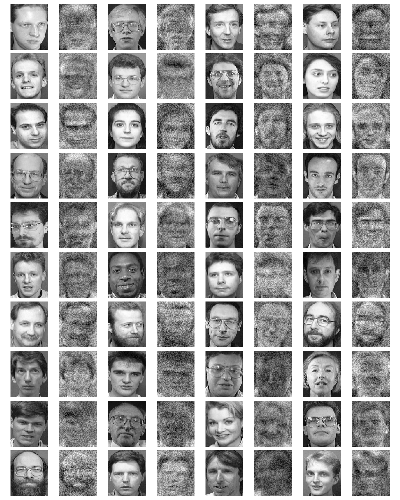
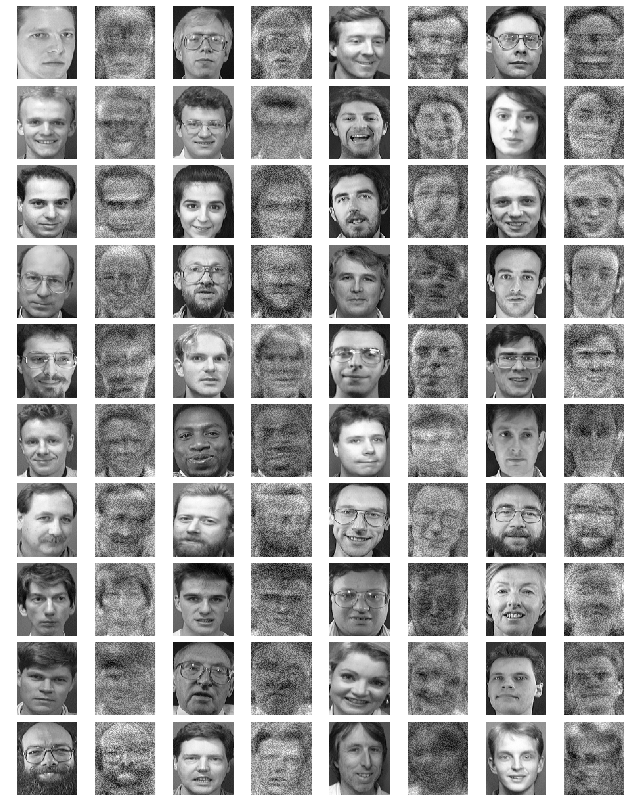

# Model-Inversion-Results-Under-Different-Optimization-Strategies

  

**Figure 1:** Reconstructed class prototypes using SGD optimizer.

  

**Figure 2:** Reconstructed class prototypes using Nesterov optimizer.

  

**Figure 3:** Reconstructed class prototypes using AdaGrad optimizer.

  

**Figure 4:** Reconstructed class prototypes using RMSprop optimizer.

  

**Figure 5:** Reconstructed class prototypes using Adam optimizer.

  

**Figure 6:** Reconstructed class prototypes using AdamW optimizer.

  

**Figure 7:** Reconstructed class prototypes using AdaBelief optimizer.

  

**Figure 8:** Reconstructed class prototypes using L-BFGS optimizer.

